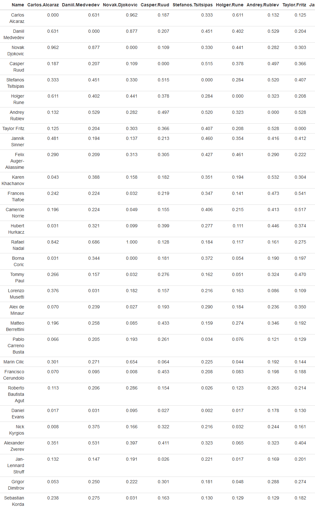

# ATP
 
This is a project to attempt to score how anticipated or interesting a tennis match is between two ATP, given a head to head.
It makes some assumptions, such as using career high instead of current ranking for inactive players
since it is likely that that is how they are remembered.

